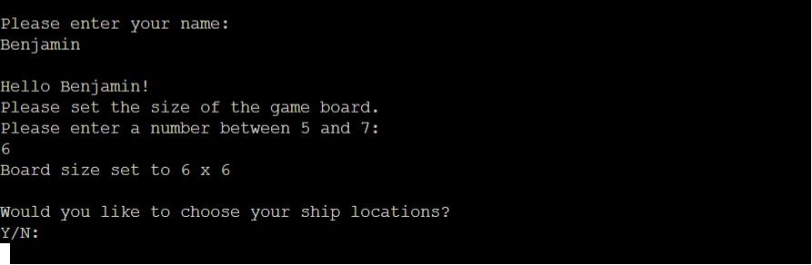
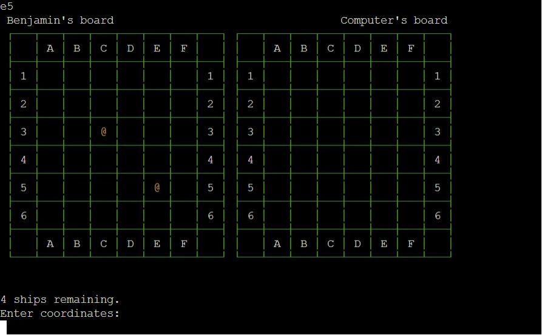
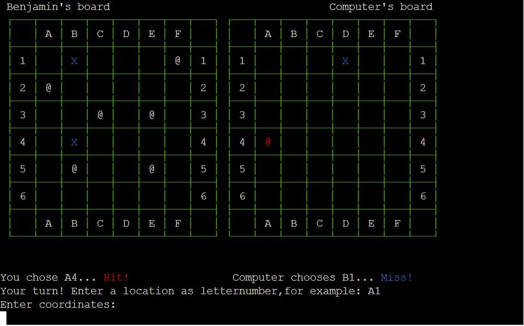
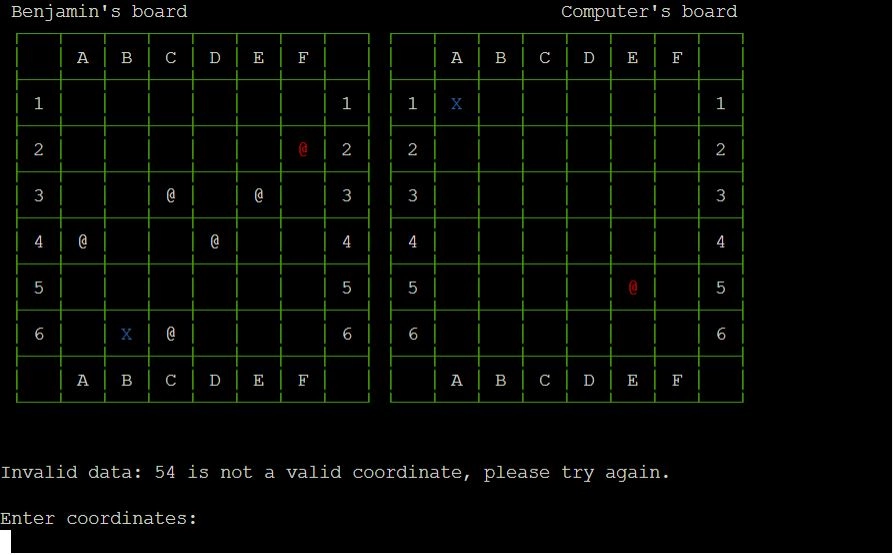
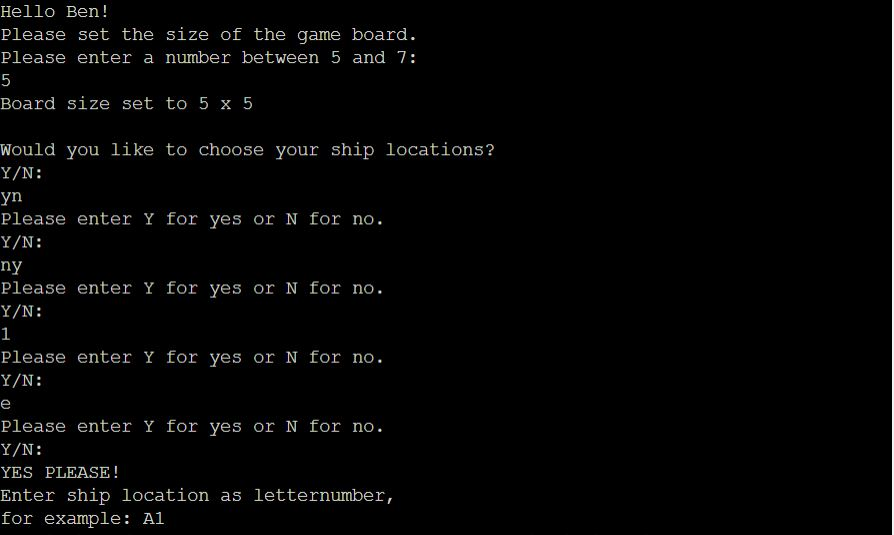

BATTLESHIPS

BATTLESHIPS is a digital reimagining of the classic strategy guessing game. It runs in the Code Institute mock terminal on Heroku.

The goal of the game is to guess the locations of the computer player's warships before it can guess yours. Players take turns calling shots and those locations are recorded on two grids.

The game can be accessed [here](https://bb-battleships-f22f01c35958.herokuapp.com/)

## How to Play

- Each player first chooses the locations of their warships, and then take turns calling shots
- During the player's turn, they are prompted to enter a grid coordinate to guess. If the coordinate chosen contains an enemy warship, a hit is recorded on the grid and the warship is destroyed. If the grid coordinate contains no enemy warship then a miss is recorded as a blue x.
- The game ends when one player has eliminated all of their oponent's warships

## Features

- A splash 'page' welcomes the player and prompts them to enter their name
- The user can choose between 3 sizes of game grid; 5x5, 6x6 or 7x7

- The user can choose to place their ships themselves by entering coordinates or opt to place them randomly. Ships are displayed in yellow to differentiate between the setup phase and the guessing phase.

- A grid is displayed in text showing the player's ships and all previous computer guesses. If the player's ships have been hit, they are displayed in red. Missed shots are shown in blue.
- A second grid is shown with the same information minus the location of the computer player's ships, which only appear once they have been hit.
- Underneath the grid, the results of both player's previous guesses are shown. Hits are shown in red, misses in blue.

- Any error messages include the grids so that in the event of an invalid input, the previous guesses text is replaced by the error message.
- The user can enter guesses using the command line. The expected format is given as an example.

### Input validation

- All user inputs can be entered in upper or lower case, the game automatically converts all inputs into upper case as part of the validation.

- Yes/No inputs such as the choice of random ship placement or to play again are tested so that only an input containing Y but not N will count as a yes input and vice versa. If the user inputs neither Y or N then they will be prompted to try again.

- Grid coordinate inputs are expected in letter-number format, for example A1, B2 and so on.
- Inputs that are not exactly 2 characters are rejected
- Inputs that are number-letter (1A, 2B etc) are rejected
- Inputs that are number-number (11, 22 etc) are rejected
- Inputs that are letter-letter (AA, BB etc) are rejected
- Inputs that are outside of the grid size (A0, B9 etc) are rejected
- Inputs that have already been successfully (previous guesses or already placed ships) entered are rejected

- The name entered at the beginning of the game is limited to a maximum of 30 characters so that it does not result in a new line.