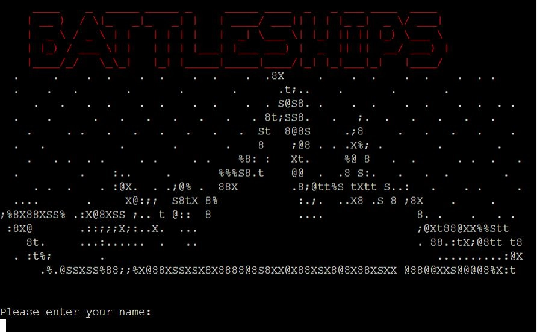

BATTLESHIPS

BATTLESHIPS is a digital reimagining of the classic strategy guessing game. It runs in the Code Institute mock terminal on Heroku.

The goal of the game is to guess the locations of the computer player's warships before it can guess yours. Players take turns calling shots and those locations are recorded on two grids.

The game can be accessed [here](https://bb-battleships-f22f01c35958.herokuapp.com/)

## How to Play

- Each player first chooses the locations of their warships, and then take turns calling shots
- During the player's turn, they are prompted to enter a grid coordinate to guess. If the coordinate chosen contains an enemy warship, a hit is recorded both in text and on the grid. If the grid coordinate contains no enemy warship then a miss is recorded as a blue x.

## 2

