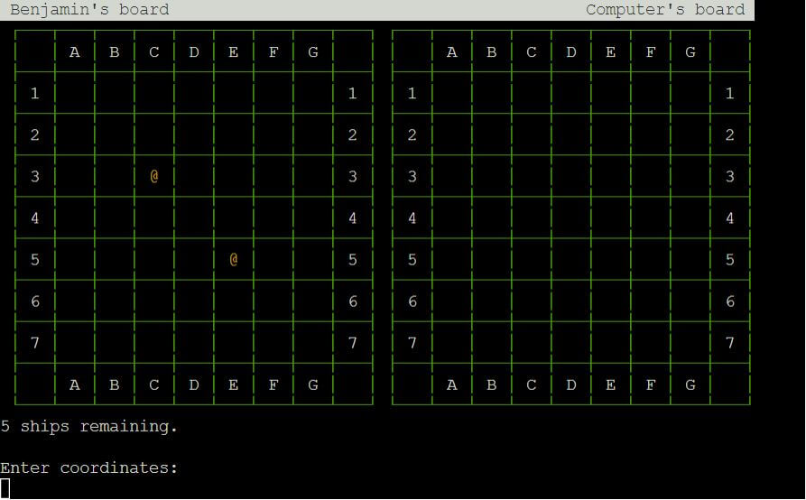
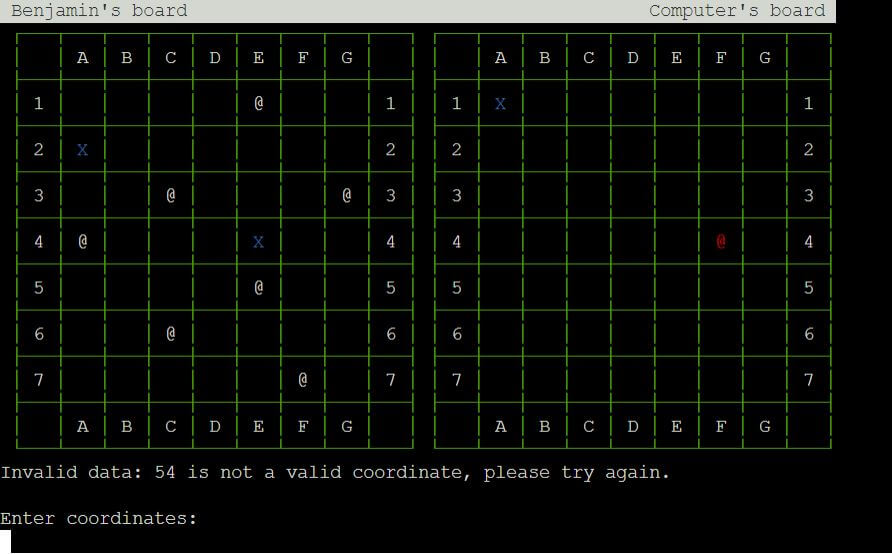

BATTLESHIPS

BATTLESHIPS is a digital reimagining of the classic strategy guessing game. It runs in the Code Institute mock terminal on Heroku.

The goal of the game is to guess the locations of the computer player's warships before it can guess yours. Players take turns calling shots and those locations are recorded on two grids.

The game can be accessed [here](https://bb-battleships-f22f01c35958.herokuapp.com/)

## How to Play

- Each player first chooses the locations of their warships, and then takes turns calling shots
- During the player's turn, they are prompted to enter a grid coordinate to guess. If an enemy warship is present at the coordinates, a hit is recorded on the grid and the warship is destroyed. If the grid coordinate contains no enemy warships then a miss is recorded as a blue x.
- The game ends when one player has eliminated all of their opponent's warships

## Features

- A splash 'page' welcomes the player and prompts them to enter their name.
- The user can choose between 3 sizes of game grid; 5x5, 6x6 or 7x7

- The user can choose to place their ships themselves by entering coordinates or opt to place them randomly. Ships are displayed in yellow to differentiate between the setup phase and the guessing phase.

- A grid is displayed in text showing the player's ships and all previous computer guesses. If the player's ships have been hit, they are displayed in red. Missed shots are shown in blue.

- A second grid is shown with the same information minus the location of the computer player's ships, which only appear once they have been hit.

- Underneath the grid, the results of both player's previous guesses are shown. Hits are shown in red, misses in blue.

- Any error messages include the grids so that in the event of an invalid input, the previous guess text is replaced by the error message.

- The user can enter guesses using the command line. The expected format is given as an example.

- When one player has hit all the other player's warships, the user is asked if they want to play again.

### Input validation

- All user inputs can be entered in upper or lower case, the game automatically converts all inputs into upper case as part of the validation.

- Yes/No inputs such as the choice of random ship placement or to play again are tested so that only an input containing Y but not N will count as a yes input and vice versa. If the user inputs neither Y nor N then they will be prompted to try again.

- Grid coordinate inputs are expected in letter-number format, for example A1, B2 and so on.
  - Inputs that are not exactly 2 characters are rejected
  - Inputs that are number-letter (1A, 2B etc) are rejected
  - Inputs that are number-number (11, 22 etc) are rejected
  - Inputs that are letter-letter (AA, BB etc) are rejected
  - Inputs that are outside the grid (A0, B9 etc) are rejected
  - Inputs that have already been successfully entered(previous guesses or already placed ships) are rejected
- All rejected inputs are handled through an except block which also prints the grid. As this all takes place in a while loop it prevents lines building up underneath the grid, pushing it out of view

- The name entered at the beginning of the game is limited to a maximum of 30 characters so that it does not result in a new line.

### Data Model

The GAME class stores information like board size, player guesses and warship locations.

Warship locations are stored as grid references. These are strings 2 characters long; the first character is an upper case letter, the second character is a number (A1, B2 etc)

Previous guesses and warship locations are stored as lists of grid references in the GAME class. When validating guesses, the input is compared to these lists.

["A1", "B2"]

When randomly generating locations or checking if inputs are within the bounds of the game, each character is converted to an integer to compare against the grid.

Characters to display on the game boards are stored in arrays, which are updated when guesses are made.
The x and y values are compared to the appropriate list to determine what character to display ("@", "X" or " ").

When displaying each player's game boards, for loops are used to print the characters ─, │, ┌, ┐, └, ┘, ├, ┤, ┬, ┴ and ┼ to draw a grid over several lines. During iteration:
- The board label list is used to provide values for the horizontal axis labels.
- The appropriate array is checked to determine the character to display and what colour it should be.

# Technologies

- Python was used as the programming language to make the game.
- The [Random](https://docs.python.org/3/library/random.html#random.Random) Python module has been used to provide randomly generated numbers.
- GitHub has been used to store code, images and other content.
- Heroku was used to deploy the game to the web.
- Git was used for version control, pushing contents to GitHub.
- Codeanywhere was used as an IDE.
- [CI Python Linter](https://pep8ci.herokuapp.com/) was used to test Python code.
- Paint.NET was used to edit images for the readme.
- [TinyPNG](https://tinypng.com/) was used to optimise images for the readme.

# Testing

- Name

  - Test: Enter a name that is longer than 31 characters.
    - Result: The appropriate message is displayed, and the user is prompted to try again.

  - Test: Enter a name 30 characters or shorter.
    - Result: The input is accepted and the name entered is shown in the gameplay phase.

- Board size

  - Test: Enter a string when an integer is expected.
    - Result: The appropriate message is displayed, and the user is prompted to try again.

  - Test: Enter a number smaller than 5 or bigger than 7.
    - Result: The appropriate message is displayed, and the user is prompted to try again.

  - Test: Enter 5, 6 or 7.
    - Result: The input is accepted and the correct board size is shown later.

- Ship placement decision

  - Test: Enter a number when a string is .
    - Result: The appropriate message is displayed, and the user is prompted to try again.

  - Test: Enter a string without the letters Y or N.
    - Result: The appropriate message is displayed, and the user is prompted to try again.

  - Test: Enter "YN".
    - Result: The appropriate message is displayed, and the user is prompted to try again.

  - Test: Enter "NY".
    - Result: The appropriate message is displayed, and the user is prompted to try again.

  - Test: Enter "Y".
    - Result: The player is prompted to place their ships.

  - Test: Enter "N".
    - Result: The player's warships are assigned random locations on the grid and the game begins.

- Ship placement

  - Test: Enter one letter or number.
    - Result: The appropriate message is displayed, and the user is prompted to try again.

  - Test: Enter three or more characters.
    - Result: The appropriate message is displayed, and the user is prompted to try again.

  - Test: Enter two letters.
    - Result: The appropriate message is displayed, and the user is prompted to try again.

  - Test: Enter two numbers.
    - Result: The appropriate message is displayed, and the user is prompted to try again.

  - Test: Enter a number followed by a letter.
    - Result: The appropriate message is displayed, and the user is prompted to try again.

  - Test: Enter a coordinate with a letter outside the grid (Z1).
    - Result: The appropriate message is displayed, and the user is prompted to try again.

  - Test: Enter a coordinate with a number outside the grid (A9).
    - Result: The appropriate message is displayed, and the user is prompted to try again.

  - Test: Enter a coordinate that is inside the grid as letter-number.
    - Result: The coordinate is accepted and a "@" is shown in the correct grid location. The ships remaining message has been updated.

  - Test: Enter a coordinate that has already been used.
    - Result: The appropriate message is displayed, and the user is prompted to try again

  - Test: Continue entering coordinates for each grid size until the game begins.
    - Result: The correct number of ships are allocated for each grid size. The "@" shown turns white once the game begins.

- Calling shots

  - Test: Enter one letter or number.
    - Result: The appropriate message is displayed, and the user is prompted to try again.

  - Test: Enter three or more characters.
    - Result: The appropriate message is displayed, and the user is prompted to try again.

  - Test: Enter two letters.
    - Result: The appropriate message is displayed, and the user is prompted to try again.

  - Test: Enter two numbers.
    - Result: The appropriate message is displayed, and the user is prompted to try again.

  - Test: Enter a number followed by a letter.
    - Result: The appropriate message is displayed, and the user is prompted to try again.

  - Test: Enter a coordinate with a letter outside the grid (Z1).
    - Result: The appropriate message is displayed, and the user is prompted to try again.

  - Test: Enter a coordinate with a number outside the grid (A9).
    - Result: The appropriate message is displayed, and the user is prompted to try again.

  - Test: Enter a coordinate that is inside the grid and has not been previously tried.
    - Result: The grid updates after the computer has played their turn and the message at the bottom of the grid shows the correct location.

  - Test: Enter a coordinate that has been tried already.
    - Result: The appropriate message is displayed, and the user is prompted to try again.

  - Test: Continue entering coordinates until either the user or the computer has hit all warships.
    - Result: The game ends, and the user is asked if they would like to play again.

  - Test: Continue entering coordinates until both the user and the computer hit all 5 ships on the same turn.
    - Result: Registered as a computer win and the player is asked if they would like to play again. Changed code to check if the player has already won before declaring victory for the computer.
    - Redo test:
      - Result: Registered as a player win and the player is asked if they would like to play again.

- Play again decision

  - Test: Enter a number when a string is .
    - Result: The appropriate message is displayed, and the user is prompted to try again.

  - Test: Enter a string without the letters Y or N.
    - Result: The appropriate message is displayed, and the user is prompted to try again.

  - Test: Enter "YN".
    - Result: The appropriate message is displayed, and the user is prompted to try again.

  - Test: Enter "NY".
    - Result: The appropriate message is displayed, and the user is prompted to try again.

  - Test: Enter "Y".
    - Result: The game begins again from the splash 'page'.

  - Test: Enter "N".
    - Result: The program quits.

# Deployment

The following steps were taken to deploy:
- Go to [Heroku](https://heroku.com/), click 'New', 'create new app'.
- Set the App name. Choose Europe as region.
- In Settings, set a new config var with a key of PORT and a value of 8000.
- In Settings, add buildpacks Python and NodeJS in that order.
- In Deploy, set deployment method to GitHub.
- Connect to GitHub and search for the correct repository.
- Ensure the deploment is from main branch.
- Enable Automatic Deploys.
- Click Deploy Branch.
- The deployed app can be found [here](https://bb-battleships-f22f01c35958.herokuapp.com/).

# Features to implement

- Ships that span more than one cell, and for the computer player to guess around a hit.

# Credits

The mock terminal used to host the game has been created by Code institute.

Instructions on how to use ANSI escape codes to set the colour of the text were taken from [here](https://www.geeksforgeeks.org/how-to-add-colour-to-text-python/).

The Battleship Board game is believed to have originated in WW1 and was popularised by various companies in the 20th century, notably Starex, Milton Bradley Corporation and Hasbro.